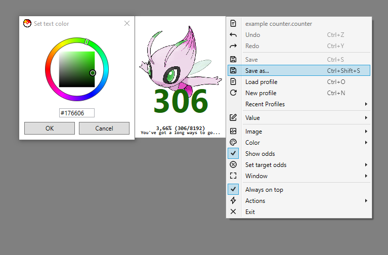
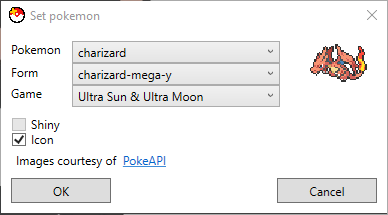

# PokeCounter
A lightweight customizable pokemon counter for shiny hunters

## Features

- Up/down key increments/decrements value
- Global hotkeys for incrementing and decrementing (add/subtract per default)
- Saving to file
- Undo/Redo
- Customization (background, image, text, window size)
- Setting odds, and cumulative percentage calculation
- Selecting a pokemon sprite from PokeAPI

... and more!
[Click here for full list of available actions and features](FEATURES.md)

## Planned features

- Autosave
- More customizations for text
- Remember window position for easier multiple counter layout
- More and better keybinding
